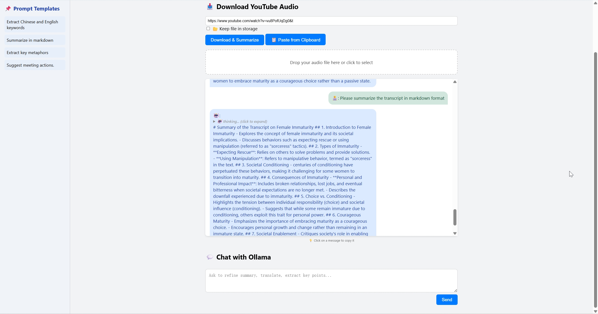

# 🎙️ AutoNotes

**AutoNotes** is a powerful web-based transcription and summarization tool that combines the capabilities of [Whisper](https://github.com/openai/whisper), [Ollama](https://ollama.com/), and [yt-dlp](https://github.com/yt-dlp/yt-dlp). It allows users to upload or download audio (e.g., from YouTube), transcribe it, summarize its content, and chat with a language model—all from an intuitive and interactive UI.

---

## ✨ Features

- 🔉 Audio upload with drag-and-drop UI
- 🧠 Whisper-based transcription
- ✍️ Ollama-powered summarization and chatbot
- 📥 YouTube audio downloader via `yt-dlp`
- 📋 Clipboard-aware auto-fill for YouTube links
- 📂 Optional file storage to persist downloaded files
- 💬 Prompt templates with click-to-insert and editable chat
- 🔒 Click-to-copy that excludes AI's inner `<think>` thoughts

---

## 📦 Requirements

- Python 3.8+
- [yt-dlp](https://github.com/yt-dlp/yt-dlp) installed and available in PATH
- A running Ollama instance
- Whisper model (e.g., `medium`) will be downloaded on first run

### 🔧 Python dependencies
Install using `requirements.txt`:

```bash
pip install -r requirements.txt
````

---

## 🚀 Getting Started

### 1. Clone the repository

```bash
git clone https://github.com/your-username/AutoNotes.git
cd AutoNotes
```

### 2. Set up the virtual environment

```bash
python -m venv .venv
source .venv/bin/activate
```

### 3. Install dependencies

```bash
pip install -r requirements.txt
```

### 4. Run the app

```bash
flask run
```

Then open [http://localhost:5000](http://localhost:5000) in your browser.

---

## ⚙️ Environment Configuration

You can override default settings with environment variables:

```env
OLLAMA_API=http://localhost:11434/api/chat
LLM_MODEL=deepseek-r1:14b
WHISPER_MODEL_DIR=./models/whisper
```

---

## 🔁 Running from Anywhere

To run the app with a single command like `autonote`, follow these steps:

1. Create an executable script called `autonote`:

   ```bash
   touch autonote
   chmod +x autonote
   ```

2. Paste the following into the script:

   ```bash
   #!/bin/bash
   cd /your/path/to/AutoNotes
   source .venv/bin/activate
   flask run
   ```

3. Move it to a directory in your `$PATH`:

   ```bash
   sudo mv autonote /usr/local/bin/autonote
   ```

Now run:

```bash
autonote
```

---

## 📁 File Storage Behavior

* Downloaded audio files are saved to `/tmp` by default and cleaned up after summarization.
* If the **Store** button is clicked, the file is moved to `./storage/` and retained.

## 💡 Use Cases

- 🧑‍🎓 Students summarizing lectures
- 🎙️ Podcasters extracting show notes
- 📽️ YouTubers creating video abstracts
- 💼 Professionals capturing meeting takeaways

---

## 📣 Contributions

Feel free to open issues or pull requests to improve the tool!

---

### 🧠 Powered by:

- [Whisper by OpenAI](https://github.com/openai/whisper)
- [Ollama](https://ollama.com)
- [Flask](https://flask.palletsprojects.com/)