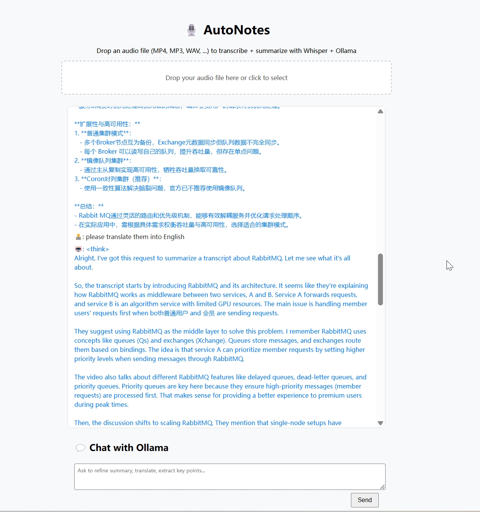

# AutoNotes: Transcribe, Summarize & Chat with Your Own LLM

**AutoNotes** is a privacy-first, local-first web app that helps you quickly extract insights from audio or video files using [Whisper](https://github.com/openai/whisper) for transcription and [Ollama](https://ollama.com) for large language model (LLM) summarization and refinement.

Upload a file, get an instant transcript and summary, and continue chatting with the LLM to refine, translate, or extract key points — all running locally to protect your data.

---

## ✨ Features

- 🔒 **Privacy-First**: Everything runs locally using Whisper and Ollama.
- 🧠 **Smart Summaries**: Automatically generate summaries from audio/video content.
- 💬 **Conversational Refinement**: Ask follow-up questions or refine summaries via chat.
- 🖥️ **Web UI**: Simple drag-and-drop interface with streaming LLM replies.
- ⚡ **Fast Transcription**: Use Whisper with GPU acceleration (in `flask run`) or CPU (via Docker).



---

## 🛠️ Setup Instructions

### 1. Install Ollama

Follow the [Ollama installation guide](https://ollama.com/download) for your OS.

Then download a compatible LLM:

```bash
ollama pull deepseek-r1:14b
```

> You can use another model if you prefer — just update `LLM_MODEL` in `config.py`.

---

## 🧪 Development Mode (Whisper on GPU)

Requires Python 3.10+ and GPU support.

```bash
# Clone and setup
git clone https://github.com/your-username/autonotes
cd autonotes

# Create virtual environment
python -m venv .venv
source .venv/bin/activate

# Install dependencies
pip install -r requirements.txt

# Run the Flask app
flask run
```

Visit: [http://localhost:5000](http://localhost:5000)

---

## 🐳 Docker Mode (CPU only)

> This mode uses Whisper with CPU (slower) but simplifies setup via Docker.

### 1. Build & Run

```bash
docker-compose up --build
```

Then open: [http://localhost:5000](http://localhost:5000)

---

## 📁 Project Structure

```
autonotes/
├── app/
│   ├── __init__.py
│   ├── routes/
│   │   ├── summarize.py
│   │   └── chat.py
│   ├── templates/
│   │   └── index.html
│   └── static/         # (Optional for future assets)
├── config.py
├── Dockerfile
├── docker-compose.yml
├── requirements.txt
└── README.md
```

---

## 🔧 Configuration

Edit `config.py` or override via environment variables:

```python
OLLAMA_API = os.getenv("OLLAMA_API", "http://localhost:11434/api/chat")
LLM_MODEL = os.getenv("LLM_MODEL", "deepseek-r1:14b")
WHISPER_MODEL_DIR = os.getenv("WHISPER_MODEL_DIR", "./models/whisper")
```

---

## 💡 Use Cases

- 🧑‍🎓 Students summarizing lectures
- 🎙️ Podcasters extracting show notes
- 📽️ YouTubers creating video abstracts
- 💼 Professionals capturing meeting takeaways

---

## 📣 Contributions

Feel free to open issues or pull requests to improve the tool!

---

### 🧠 Powered by:

- [Whisper by OpenAI](https://github.com/openai/whisper)
- [Ollama](https://ollama.com)
- [Flask](https://flask.palletsprojects.com/)